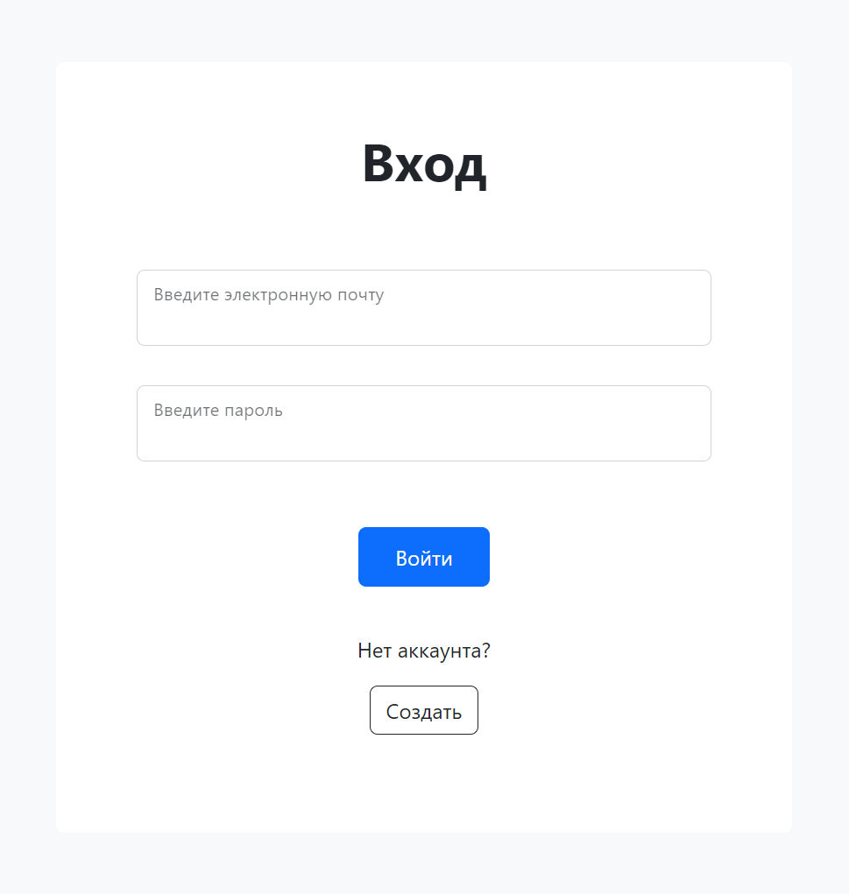
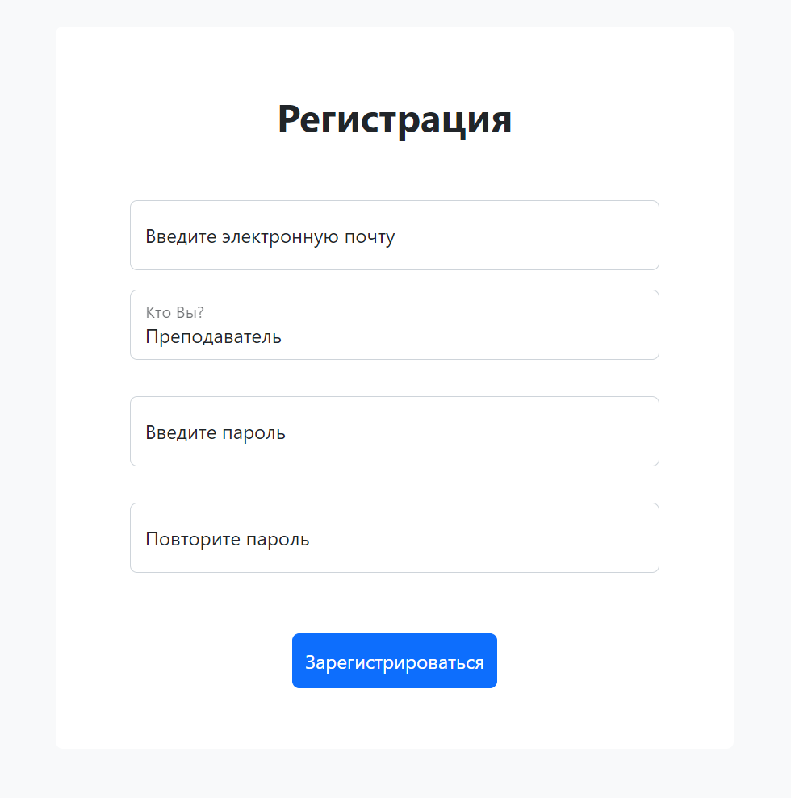
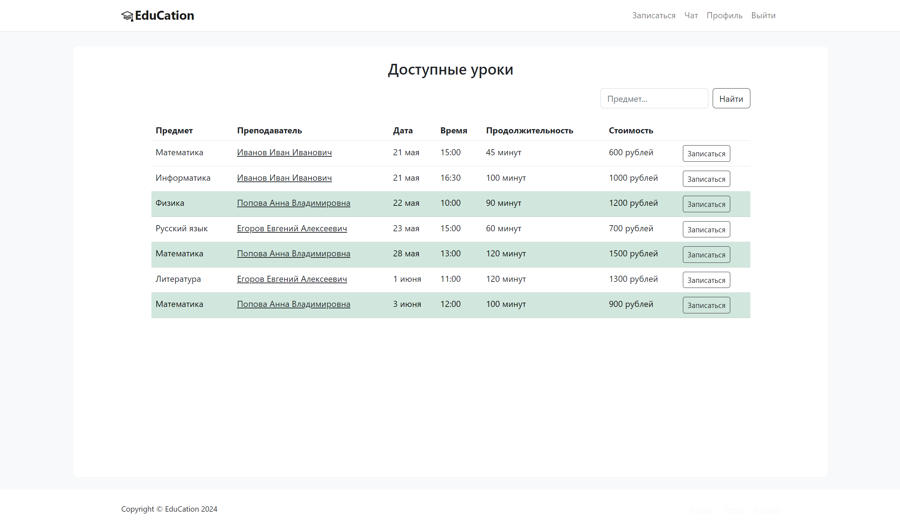

# Образовательная платформа

Образовательная платформа для организации взаимодействия между учениками и репетиторами.

## Содержание

- [Функциональные возможности](#функциональные-возможности)
- [Требования](#требования)
- [Установка](#установка)
- [Использование](#использование)
- [База данных](#база-данных)
- [Клиентская часть](#клиентская-часть)
## Функциональные возможности

- Регистрация новых пользователей с возможностью выбора роли на платформе (ученик/преподаватель)
- Авторизация зарегестрированных пользователей
- Создание, редактирование и удаление профиля пользователя
- Создание и управление уроками
- Поиск и запись на уроки
- Просмотр расписания запланированных уроков
- Система обмена сообщениями между учениками и репетиторами
- Создание, выполнение и проверка домашних заданий

## Требования

- Python 3.8+
- Django 3.2+
- PostgreSQL

## Установка

1. **Установка репозитория**:
```bash
git clone https://github.com/nad-usik/Learning-platform.git
cd Learning-platform
```
2. **Создание и активация виртуального окружения**:
  ```bash
python -m venv venv
source venv/bin/activate  # Для Windows используйте `venv\Scripts\activate`
```
3. **Установка зависимостей**:
```bash
pip install -r requirements.txt
```
4. **Настройка базы данных**:
   
- Откройте pgAdmin 4
- Создайте базу данных для проекта
- Обновите настройки DATABASES в файле learning_platform/settings.py
<p align=center>

</p>
     
5. **Применение миграций**:
```bash
cd learning_platform
python manage.py makemigrations
python manage.py migrate
```
6. **Создание суперпользователя**:
```bash
python manage.py createsuperuser
```
7. **Запуск сервера разработки**:
```bash
python manage.py runserver
```
## Использование 

- Перейдите по адресу ```http://127.0.0.1:8000``` в вашем браузере.
- Используйте административную панель по адресу ```http://127.0.0.1:8000/admin``` для управления платформой.

## База данных
Все необходимые данные организованы в 8 таблиц.
1.	```Пользователи (CustomUsers)```. 
    
    Данная таблица содержит информацию обо всех пользователях платформы. В неё входят следующие поля: электронная почта, пароль, роль на платформе, фамилия, имя, отчество, дата рождения, пол, город, номер телефона и изображение профиля. Каждая запись имеет уникальный идентификатор (первичный ключ), а также гарантируется, что электронная почта каждого пользователя уникальна.
2.	```Предметы (Subjects)```. 

    Данная таблица содержит названия предметов, доступных для изучения на платформе. 
3.	```Преподаватели (Teachers)```. 

    Данная таблица связывает идентификаторы пользователя-преподавателя из таблицы CustomUsers и предметов из таблицы Subjects, которые он собирается преподавать.
4.	```Студенты (Students)```. 

    Данная таблица содержит идентификаторы пользователей-студентов из таблицы CustomUsers.
5.	```Преподаватель-Студент (TeacherStudent)```. 

    Данная таблица содержит информацию о связи учителя (внешний ключ таблицы Teachers) и ученика (внешний ключ таблицы Students). У пользователя-преподавателя может быть множество студентов, так же, как и у пользователя-студента может быть более одного преподавателя.
6.	```Уроки (Lessons)```. 

    Данная таблица хранит информацию обо всех уроках, предлагаемых на платформе. Каждая запись содержит идентификатор преподавателя и предмета, дату и время, продолжительность, информацию о возможности записи на урок, а также идентификатор записавшегося студента.   
7.	```Задания (Assignments)```. 

    В данной таблице хранятся индивидуальные домашние задания, созданные преподавателем для учеников. Каждому заданию соответствует учитель, ученик и предмет (внешние ключи таблиц Teachers, Students, Subjects). Помимо внешних ключей, таблица содержит поля с заголовком и текстовым содержанием задания, временем его создания, сроком сдачи, прикрепленными файлами и изображениями, текстовым содержанием и файлом ответа на задание, а также поля с информацией о том, было ли сдано и проверено задание.
8.	```Сообщения чата (ChatMessages)```. 

    Таблица для хранения сообщений из диалогов между преподавателями и студентами. Она содержит текст сообщения, время его отправления, информацию о том, было ли оно прочитано, а также идентификаторы отправителя и получателя (внешние ключи таблицы CustomUsers).


## Клиентская часть

Платформа включает в себя следующие страницы страницы:
- Главная страница
- Страница входа
- Страница регистрации
- Страница заполнения профиля
- Страница просмотра информации профиля
- Страница редактирования профиля
- Основная страница пользователя
- «Календарь» пользователя
- Страница создания урока
- Страница поиска и записи на урок
- Страница списка студентов/преподавателей пользователя
- Страница просмотра профиля преподавателя/студента
- Главная страница чата
- Страница переписки пользователей
- Страница выбора студента преподавателем для работы с домашними заданиями
- Страница просмотра текущих домашних заданий
- Страница просмотра завершенных домашних заданий
- Страница добавления заданий преподавателем
- Страница просмотра содержания, добавления ответа и проверки задания

Ниже изображена схема перехода между страницами сайта. 
- Серым цветом выделены страницы, доступные всем пользователям
- Синим цветом – доступные только авторизованным пользователям
- Зелёным цветом – доступные только преподавателям, желтым цветом – доступные только студентам.


## Пользовательский интерфейс

Для доступа к функциям платформы пользователь должен авторизоваться. В случае несоответствия введённых данных пользователю выводится сообщение об ошибке, и предлагается повторно заполнить данную форму. Если пользователь не был ранее зарегистрирован на платформе, ему необходимо перейти на страницу регистрации.

<p align=center>

</p>
  
Если электронная почта, указанная на странице регистрации, уже зарегистрирована или введённые пароли не совпадают, пользователю выводится сообщение об ошибке и предлагается повторно заполнить форму. Если регистрация прошла успешно, пользователь будет направлен на страницу заполнения профиля.

<p align=center>

</p>

Форма на странице для заполнения профиля отличается в зависимости от роли пользователя. Для преподавателей предусмотрено дополнительное поле, где необходимо выбрать предмет/предметы, которые они планируют преподавать на платформе. Если обязательное поле не было заполнено, пользователь останется на текущей странице, а незаполненное поле будет подсвечено.

<p align=center>

</p>

После успешного сохранения информации пользователь будет перенаправлен на страницу просмотра информации профиля. В дальнейшем перейти на страницу просмотра профиля можно, нажав на кнопку «Профиль» на главной навигационной панели.

<p align=center>

</p>

При нажатии на кнопку «Редактировать профиль» пользователь может изменить личную информацию, введённую при регистрации. Форма на странице будет автоматически заполнена данными из БД. 

Пользователь может удалить свой аккаунт, нажав на соответствующую кнопку. При этом появится окно для подтверждения действия.

На основную страницу можно перейти, нажав на кнопку с логотипом на навигационной панели. 

Основная страница пользователя-преподавателя:
<p align=center>

</p>

Основная страница пользователя-ученика:

<p align=center>

</p>

«Календарь» для пользователя-студента вид данной страницы, изображенной на рисунке 14, представляет собой таблицу с предстоящими занятиями, отсортированными по дате, с подробной информацией. 

<p align=center>

</p>

На странице «Календарь» у пользователя-преподавателя отображена информация обо всех запланированных им занятиях. Основная часть страницы разделена на две секции: запланированные уроки и уроки доступные для записи. В таблицах для каждого занятия представлена информация о дате и времени его проведения, предмете и стоимости.

<p align=center>

</p>
 
Страница создания урока:

<p align=center>

</p>

Страница для поиска и записи на урок. Для удобного поиска уроков их можно фильтровать. Зелёным цветом в таблице подсвечены уроки преподавателей, с которыми пользователь ранее занимался.  

<p align=center>

</p>

На странице домашних задний преподавателя представлен список всех студентов, которым он может давать задания. Нажав на карточку студента, преподаватель сможет посмотреть его текущие и завершенные задания, а таже создать новое задание. 

Страница добавления домашнего задания:

<p align=center>

</p>

Страница просмотра текущих заданий ученика:

<p align=center>

</p>

Страница просмотра завершенных заданий ученика:

<p align=center>

</p>

Страница просмотра содержания задания с формой для ответа:

<p align=center>

</p>

Страница просмотра содержания задания преподавателем до проверки:

<p align=center>

</p>

Страница просмотра содержания задания преподавателем после проверки:

<p align=center>

</p>

Страница чата:

<p align=center>

</p>

Страница переписки с пользователем:

<p align=center>

</p>